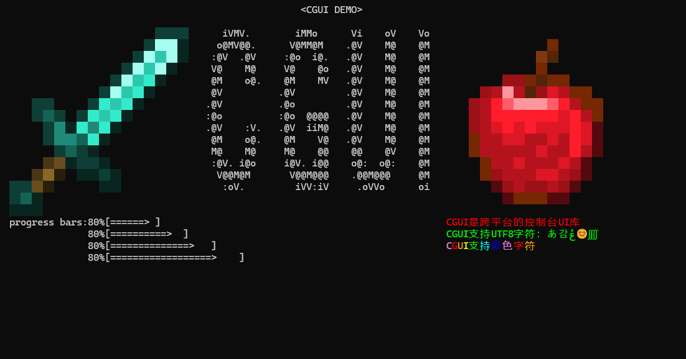
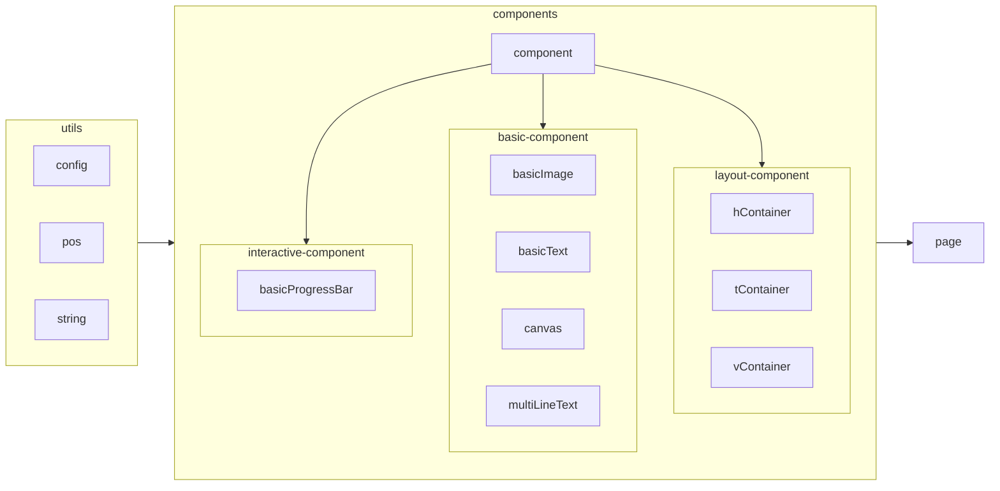

# 开源的命令行图形化库


本代码库旨在让开发者能够以一种简单的方式来在它们的命令行界面上放置一些简单控件，并摆脱对用Windows API等系统调用的依赖，以得到良好的跨平台效果
目前，计划有以下功能：
- [X] 支持UTF-8文本
- [X] 支持用ANSI转义序列的彩色文本
- [X] 单行文本的显示，更新
- [X] 多行文本的显示，更新
- [x] 字符画的显示，更新
- [x] 进度条的显示，更新，自定义样式
- [ ] 分割线的显示，更新
- [ ] 窗口的显示，更新
- [ ] 用于显示窗口的显示屏
- [X] 对组件进行水平，垂直，表格式的排版
- [X] 对组件进行自由摆放
- [ ] （窗口上）按钮的工作
- [ ] 多窗口之间切换
- [ ] 不同的页面之间的切换
- [ ] 超链接

这当前是一个WIP的项目，请不要随意clone,如要移植, 请使用releases里面公布的代码进行编译, 谢谢！
欢迎PR、star、发起issue!

## 编译方式
本项目使用cmake管理
需要使用的命令：
```
cmake -B build
```

## API 介绍

更详细的介绍可以去看一看`sandbox/demo.cpp`，里面对于每种功能几乎都有测试，风格应该也还算简单易懂
